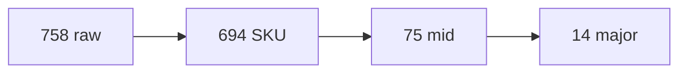

리맵 후 소분류는 약 694개다. 이를 **14개 대분류 · 75개 중분류**로 나눈 검증본이 레포 [`taxonomy/`](https://github.com/jae-hun-cho/medicine-packaging-merged/tree/main/taxonomy)에 있다. `TAXONOMY.md`, `tree.md`, `mids.csv`, `taxonomy.json`, 검증 이동은 `taxonomy-audit.md`.

758-way는 롱테일이 너무 길다. 싱글톤 114, 중앙값 17. 제품명 단위로 학습하면 같은 해열제가 Crocin·Calpol·Dolo-650·Tylenol로 갈라지고, 같은 혈압약이 Amlodipine과 amlodipine 10mg hipertensi로 갈라진다. 중분류 75는 치료 목적에 가깝게 묶되, 정품·위조처럼 제품명을 지켜야 하는 곳은 제품명으로 남긴다.

학습은 중분류 75(v3)에서만 한다. 소분류는 원본 프로젝트에 그대로 둔다.

*원본 758 → v1 소분류 694 → 학습 중분류 75 → 대분류 14.*

## 대분류 14

*taxonomy.json 대분류 14개의 n_instances. 합 49,242. 순환기 7,052가 가장 크다.*

박스 합계 49,242는 드롭 28개(2,278박스)를 뺀 리맵 후 숫자다. 원본 51,520에서 Front/Back·콘돔을 빼면 그 근처가 된다.

| 대분류 | 소분류 | 박스 | 대표 중분류 |
|---|---:|---:|---|
| 해열진통소염 | 53 | 6,898 | Paracetamol계, NSAID, 아스피린계 |
| 호흡기감기 | 109 | 5,397 | 종합감기, 진해거담, 비염알레르기 |
| 순환기 | 32 | 7,052 | Amlodipine, Losartan, 순환기-브랜드 |
| 당뇨 | 20 | 4,845 | Glimepiride, Metformin, 당뇨-브랜드 |
| 항균항바이러스 | 58 | 4,878 | 베타락탐, 세팔로스포린, 기타항균 |
| 소화기 | 49 | 2,375 | 제산궤양, 소화효소 |
| 신경정신 | 33 | 3,549 | 항우울항정신, 항전간신경통, 통풍 |
| 호르몬내분비 | 11 | 1,157 | 갑상선, 스테로이드(전신) |
| 피부외용 | 98 | 1,282 | 스테로이드외용, 파스외용, 위생화장품 |
| 비타민영양 | 68 | 2,015 | 단일영양, 종합비타민, 면역건강 |
| 피임산과 | 11 | 510 | 경구피임, 산과기타 |
| 정품위조 | 12 | 2,253 | Alaxan, Bioflu 등 제품명 쌍 |
| 한국식약처코드 | 53 | 4,974 | 식약처품목허가번호 |
| 기타 | 87 | 2,057 | 브랜드미분류, 성분명만 |

순환기 7,052박스가 대분류 중 가장 많고, 해열진통소염 6,898이 다음이다. 피부외용은 클래스 98개로 넓지만 박스는 1,282다. 식약처 코드 53개는 전부 한 중분류로 접힌다.

## 왜 75인가

중분류는 성분 계열(Paracetamol계, NSAID, 베타락탐)과 적응증(종합감기, 제산궤양), 그리고 데이터셋이 이미 들고 있는 특수 축을 섞는다.

정품·위조 12개 소분류는 제품명 중분류 여섯 쌍으로 남긴다. Alaxan 383, Bioflu 341, Biogesic 387, Decolgen 370, Medicol Advance 401, Neozep Forte 371. 위조 탐지가 목적인 소스이므로 종합감기나 NSAID로 녹이면 안 된다.

`Atova`와 `Immucept 500`은 기타/브랜드미분류에 남긴다. Atova는 아토르바스타틴과 아토바쿠온이 한 이름에 겹치고, Immucept는 면역억제제라 14개 대분류 어디에 넣어도 억지다.

TYLOLHOT는 파라세타몰+슈도에페드린+클로르페니라민 종합감기인데 v3 remap이 **Paracetamol계**로 넣었다. 알려진 냄새다. 검증 25건에는 넣지 않고, 평가 글에서 다시 본다.

## 검증에서 옮긴 25건

이름과 브랜드를 조회한 뒤 옮겼다. 목록은 [`taxonomy/taxonomy-audit.md`](https://github.com/jae-hun-cho/medicine-packaging-merged/blob/main/taxonomy/taxonomy-audit.md).

**종합감기.** Panadol Cold Flu 138, Panadol Flu Batuk 7은 해열진통소염/Paracetamol계에서 호흡기감기/종합감기로. 판피린티정 41은 기타진통에서 종합감기로. 파라세타몰이 들어 있어도 복합 감기다.

**기타호흡기.** Salmeterol 12, Budesonide 12, Fluticasone Propionate 12. 호르몬·전신 스테로이드가 아니라 흡입 호흡기다.

**외용 스테로이드 7.** Betamethasone Valerate 72, Desoximetasone 45, Clobetasol Propionate 38, Fluocinolone Acetonide 15, Betamethasone Dipropionate 11, Mometasone Furoate 8, Kenalog 1. 호르몬내분비/스테로이드 → 피부외용/스테로이드외용.

**pepfamin = 파모티딘.** 346박스. 기타/브랜드미분류에 있던 것을 소화기/제산궤양으로. 키는 `pepfamin`이다. `pepsfamin`이 아니다.

**Angenta.** 171박스. 플루펜틱솔+멜리트라센. 항우울항정신.

**Ace XR.** 268박스. paracetamol 665mg ER. 기타진통 → Paracetamol계.

나머지는 ByeBye Fever 9(해열 패치 → 파스외용), Tumeric 500 410(강황 → 면역건강), Leflunomide 20(항류마티스 → 기타진통), 파스 성분 여섯(Methyl Salicylate 123, Menthol 63, Levomenthol 104, Camphor 29, Eugenol 125, Salol and Menthol 38)이다.

25를 센 단위는 소분류 한 줄이다. 감기 복합 3, 흡입제 3, 외용 스테로이드 7, 해열 패치·강황·레플루노미드·pepfamin·Angenta·Ace XR이 6, 파스 성분 6.

## 트리

전체 중분류 75행은 `taxonomy/mids.csv`다. 접힌 예시는 `taxonomy/tree.md`. 학습 페이로드는 이 맵을 `data/mid-remap.json`으로 펼친 것이다. 다음 글은 그 페이로드를 보내는 방법이다.
