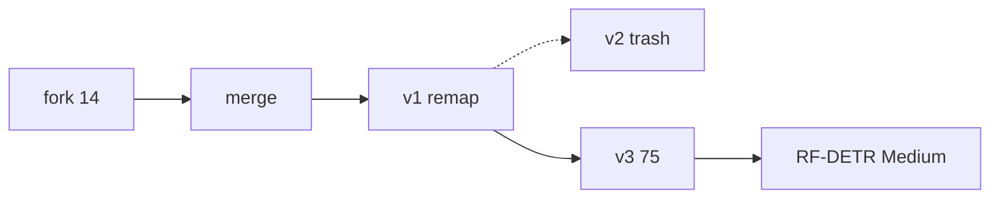

원본 프로젝트의 758 클래스는 소스 오브 트루스다. 이름을 고치거나 클래스를 지워 라이브를 편집하지 않는다. 새 버전은 항상 Roboflow `versions_generate` remap으로 만든다. 페이로드와 결과는 레포 [`versions/`](https://github.com/jae-hun-cho/medicine-packaging-merged/tree/main/versions)에 있다.

| 버전 | 장 | 클래스 | 전처리 | 용도 |
|---|---:|---:|---|---|
| 원본 프로젝트 | 28,297 | 758 | 없음 | 소스 오브 트루스 |
| **v1** | 28,119 | ~694 | auto-orient, Front/Back·콘돔 omit, 대소문자·한영·Box/Blister 병합, filter-null 100% | SKU 단위 |
| v2 | — | — | 한글 remap 깨짐. **휴지통** | 쓰지 말 것 |
| **v3** | 28,119 | **75** | v1과 같은 omit/병합 + 소분류→중분류 remap, 증강 없음 | 학습용 |

v3에서 빠진 178장은 Front/Back·콘돔만 있던 이미지다. 리사이즈와 증강은 넣지 않았다.

*fork 14 → merge → v1 remap → (v2 trash) → v3 75 → RF-DETR Medium.*

## v1 — SKU 정리

페이로드는 [`versions/v1-generate-payload.json`](https://github.com/jae-hun-cho/medicine-packaging-merged/blob/main/versions/v1-generate-payload.json). 규칙의 원본은 [`data/remap.json`](https://github.com/jae-hun-cho/medicine-packaging-merged/blob/main/data/remap.json)과 [`docs/REMAP.md`](https://github.com/jae-hun-cho/medicine-packaging-merged/blob/main/docs/REMAP.md).

1. `drop` 28개 → 빈 문자열(omit). Front 889, Back 1,353, 콘돔 26개 클래스. 드롭 박스 합계 2,278.
2. `merge` 74 → 47. 대소문자(`Metformin`+`metformin` = 817), `_Box`/`_Blister`/`_Pack`(Marvelon 152, Cefixim 200mg 136), 한글·영문(`타이레놀` 113 + Tylenol 228 = 341).
3. preprocessing: `auto-orient`, `filter-null: 100%`. 리사이즈·증강 없음.

결과 28,119장, 약 694 클래스.

## v2 — 휴지통

중분류 한글 타깃을 보내는 첫 시도가 버전 2였다. 중간에서 한글이 재인코딩되며 타깃이 깨졌다. 기록에 남은 예는 `제산궤양` → `제산권양`, `당뇨-브랜드` → `늹뇨-브랜드`.

버전 2는 soft-delete로 Trash에 넣었다. `versions/v3-generate-result.json`의 `versions_delete_v2`가 `trash: true`다. 쓰지 말 것.

원인은 모델이 아니라 바이트다. MCP나 에디터가 JSON을 다시 저장하면 UTF-8 한글이 다른 코드으로 바뀐다. 해결은 단순하다. **한글이 들어 있는 JSON은 파일 바이트 그대로 전송**한다.

## v3 — 중분류 75

페이로드는 [`versions/v3-generate-payload.json`](https://github.com/jae-hun-cho/medicine-packaging-merged/blob/main/versions/v3-generate-payload.json). 758키, omit 28, 타깃 75. v1 canon 이름 위에 [`data/mid-remap.json`](https://github.com/jae-hun-cho/medicine-packaging-merged/blob/main/data/mid-remap.json)의 `map`을 얹는다.

remap 키는 **라이브 클래스명**과 1:1이어야 한다. 라이브에는 `pepfamin`(346)이 있고 `pepsfamin`은 없다. 생성 후 샘플로 `pepfamin`→제산궤양, `Glycediab`→당뇨-브랜드, `Simethicone`→제산궤양을 확인했다.

생성 시각은 2026-08-14 13:08:45 KST. 버전 이름 `2026-08-14 4:08am`. 이미지 28,119, split **22,715 / 2,983 / 2,421**, 클래스 75. preprocessing 키는 `auto-orient`, `filter-null`, `remap`. 증강 없음.

*v3 split 22,715 / 2,983 / 2,421. 합 28,119.*

`projects_get`은 여전히 소스 프로젝트 클래스 758을 돌려준다. 버전 클래스 수는 페이로드의 비어 있지 않은 타깃 고유 값으로 센 것이다.

## 보내지 말아야 할 것

라이브 758을 에디터에서 고치지 않는다. v2를 복원하지 않는다. 한글 타깃을 콘솔에 붙여 넣거나, JSON을 다른 인코딩으로 저장하거나, `pepsfamin` 키를 만들지 않는다. 다음 글의 학습 job은 이 v3 위에서만 돌렸다.
